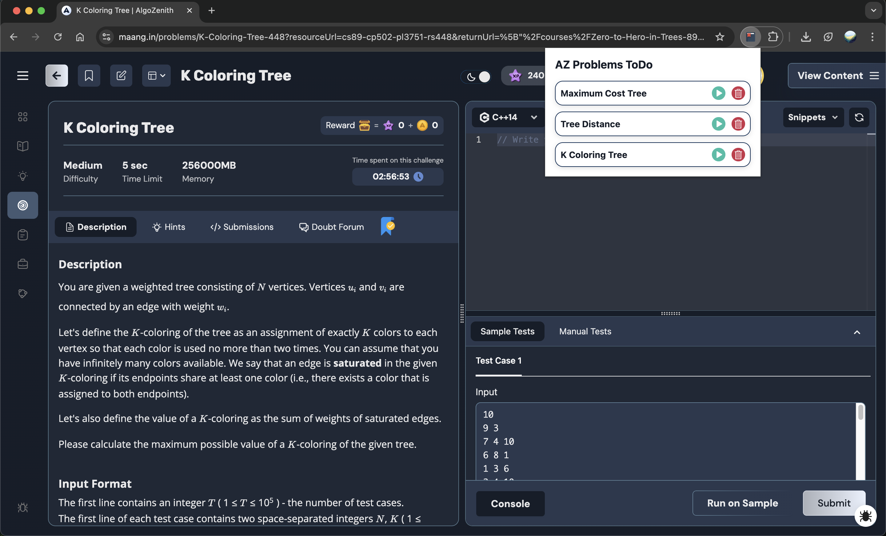

 
  

# AlgoZenith Problems ToDo Chrome Extension

A Chrome extension that adds a bookmark button to problem pages on [maang.in](https://maang.in), allowing users to save problems and later view, open, or delete their bookmarks from the extension popup.

## Features

- Adds a bookmark button to each problem page on [maang.in](https://maang.in)
- Bookmarked problems are saved in Chrome's sync storage
- View all saved problems in the extension popup
- Open problems directly from the popup
- Delete bookmarks from the popup
- Toast notification with animated progress bar when bookmarking

## Installation

1. Clone or download this repository.
2. Open Chrome and go to `chrome://extensions/`.
3. Enable **Developer mode** (top right).
4. Click **Load unpacked** and select the project folder.

## Usage

- Visit any problem page on [maang.in](https://maang.in/problems).
- Click the bookmark button in the navigation bar to save the problem.
- Click the extension icon to view, open, or delete your saved problems.

## Project Structure

- `content.js` – Injects the bookmark button and handles bookmarking logic.
- `popup.html`, `popup.js`, `popup.css` – Extension popup UI and logic.
- `background.js` – (Reserved for background tasks, currently empty)
- `manifest.json` – Chrome extension manifest.
- `assets/` – Icons and images used in the extension.
